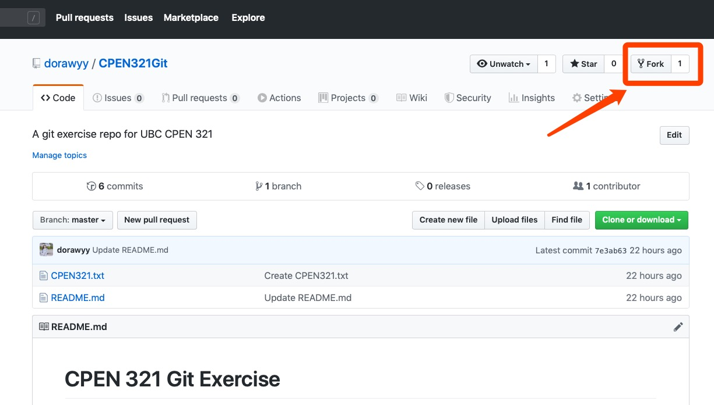
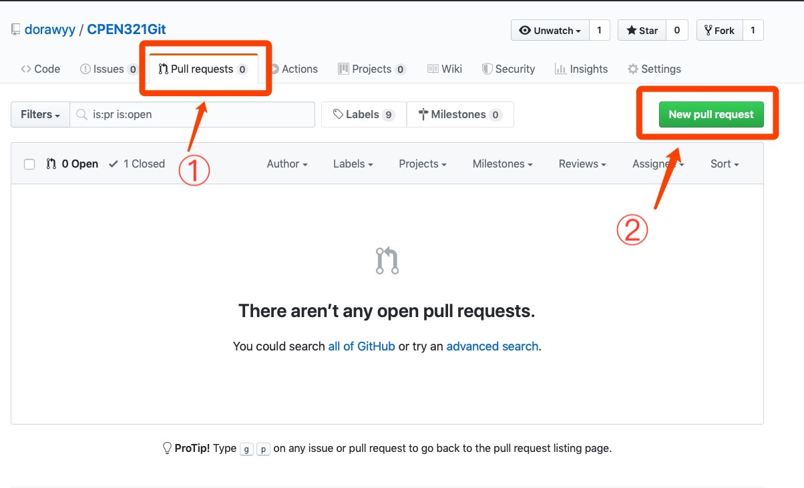
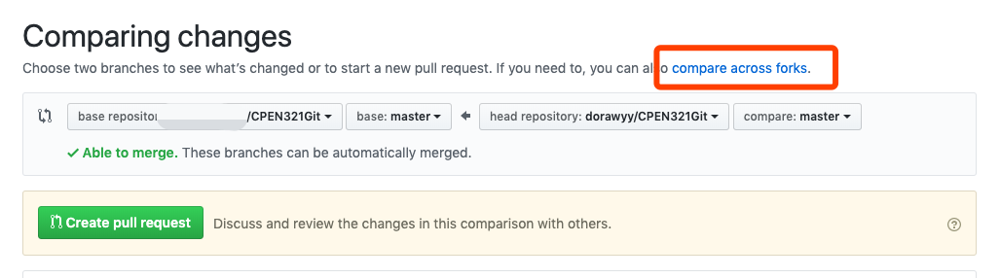
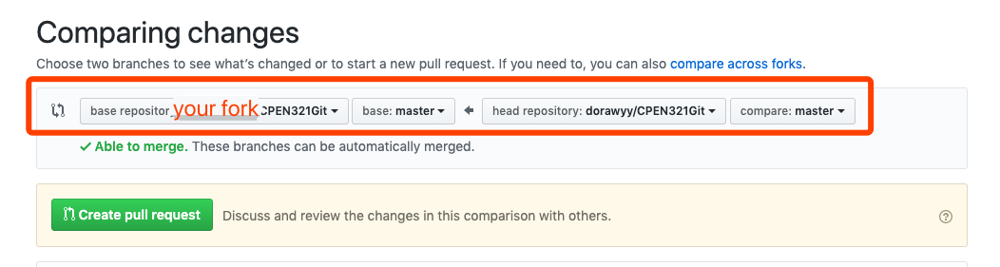
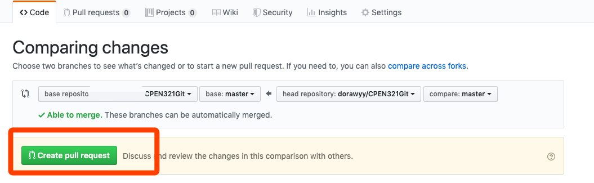
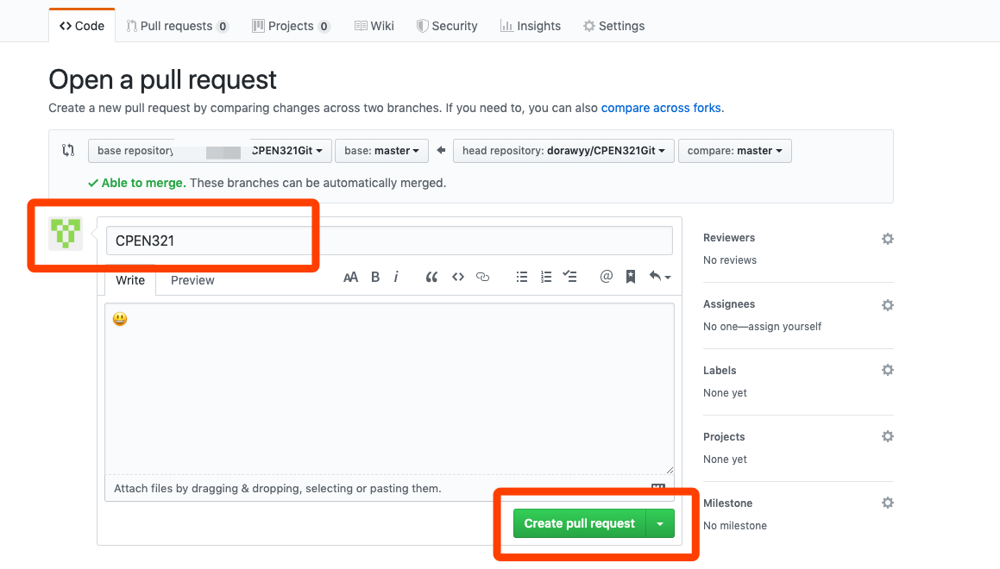

# CPEN 321 Git Exercise 

Please work in pairs to finish the following exercise. In the following, we refer you as _Student A_ and _Student B_.

## 1. Fork this repo 



## 2. Clone your forked repo to your local

```
git clone https://github.com/[githubuser]/CPEN321Git.git
```

## 3. Create a new branch `F1` in local

First, ensure you are on master branch 
```
git checkout master 
```

Then create `F1` branch
```
git checkout -b F1
```

Push the branch from local to GitHub.
```
git push origin F1
```
Now, you can see `F1` branch on GitHub also. 


## 4. Make two commits on `F1` branch: 

Let us continue working with your local clone. 

First, ensure you checkout to (or, already on) F1 branch 
```
git checkout F1
```

### _Commit 1_: 
1. Add _Student A_ [student ID]+[name] as a new line to the file `CPEN321.txt`. For example, 
```
12345678+Jane Doe
```
2. Commit changes with message "Student A".
```
git status # you will see CPEN321.txt is changed 
git add CPEN321.txt 
git commit -m "Student A"
```
    
### _Commit 2_: 
1. Similarly, add _Student B_ [student ID]+[name] as a new line to the file `CPEN321.txt`. For example,
```
87654321+John Doe
```
2. Commit with message "Student B".
```
git add CPEN321.txt 
git commit -m "Student B"
```

If you are a group of three, following commit 1 and 2 above, add a commit 3 for the third student. 


## 5. Push your new commits to GitHub 

```
git push origin F1
```

## 6.Squash commit 1 and 2 (and 3,..) to `master` branch, keep the default squash message.

First, checkout to master branch 
```
git checkout master 
```

Then, squash new commits on F1 branch (i.e., commit 1, 2, ..)
```
git merge --squash F1
```

Now, if you do `git status`, you will see your changes in commit 1 and 2 (and 3..)
```
git status
```

Finish the squash by committing 
```
git commit
```

Now if you should be able to see the squashed commit on your `master` branch, whose commit message is _"Squashed commit of the following:.."_


## 7. Push the squash commit on `master` branch to GitHub 

```
git push origin master
```

## 8. Submit a Pull Request titled `CPEN321` to the [original repo](https://github.com/dorawyy/CPEN321Git) from fork `master` branch to the original repo `master` branch. 

First, go to [original repo](https://github.com/dorawyy/CPEN321Git), create a new _Pull Reuqest_




Click _"compare across forks"_ to choose your fork



Ensure that:
* base 
    * repo: your fork repo
    * branch: `master`
* head 
    * repo: `dorawyy/CPEN321Git`
    * branch: `master`




Then, click the _"Create pull request"_



## 9. Fill in title of the Pull Request, submit! 




__Note__: _If you feel uncomfortable sharing your personal information publicly, you can replace [student ID]+[name] with [project group ID]+[name], and send an email to Dr. Rubin after class. The TAs will then use your project group ID to identify you._

